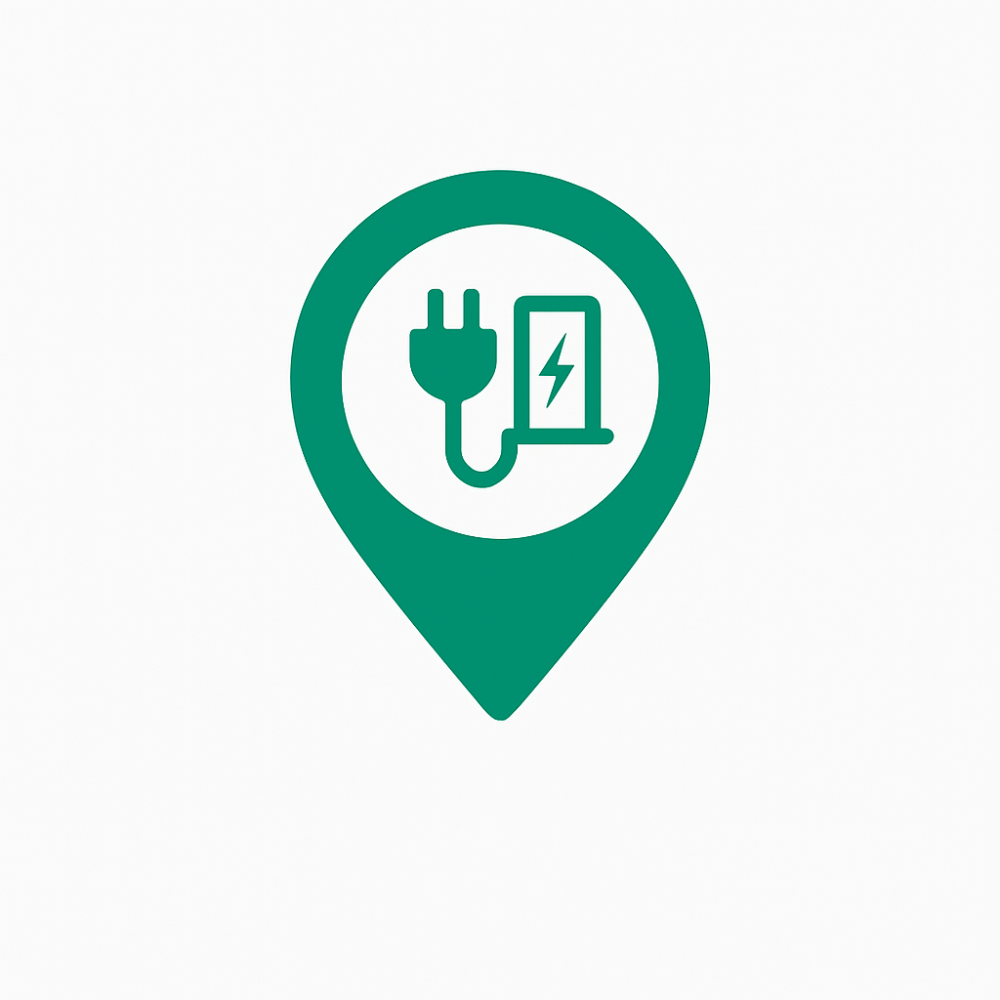

# EV_Charge 

**EV_Charge**는 전국의 전기차 충전소 위치 및 실시간 충전 가능 여부를 확인할 수 있는 웹사이트입니다.  
사용자는 지도를 통해 가까운 충전소를 쉽게 찾고, 실시간 상태를 확인하여 효율적으로 충전소를 이용할 수 있습니다.

---

## 🌟 주요 기능

- ✅ 전국 전기차 충전소 위치를 지도 기반으로 시각적으로 제공  
- ✅ 실시간 충전 가능 여부 표시 및 검색 필터 기능 (지역/충전 방식 등)
- ✅ 즐겨찾기 기능을 통해 자주 이용하는 충전소를 간편하게 확인  
- ✅ 게시판 및 공지사항 기능을 통한 사용자 간 정보 공유 및 소통
- ⏳ 리뷰 및 별점 기능으로 충전소 품질에 대한 사용자 피드백 제공   
- ⏳ 마이페이지를 통한 즐겨찾기, 리뷰 관리 등 개인화된 정보 제공

---

## 🛠 사용 기술 스택

- **Frontend**  
   

- **Backend** 
  

- **Database**  

- **지도 API**  
 

- **빌드 도구**  

---

## 📁 프로젝트 구조
